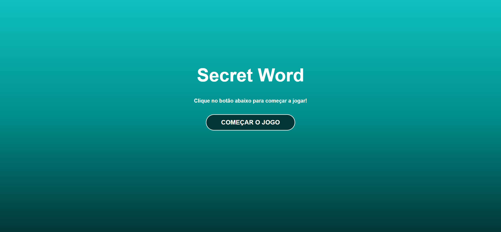
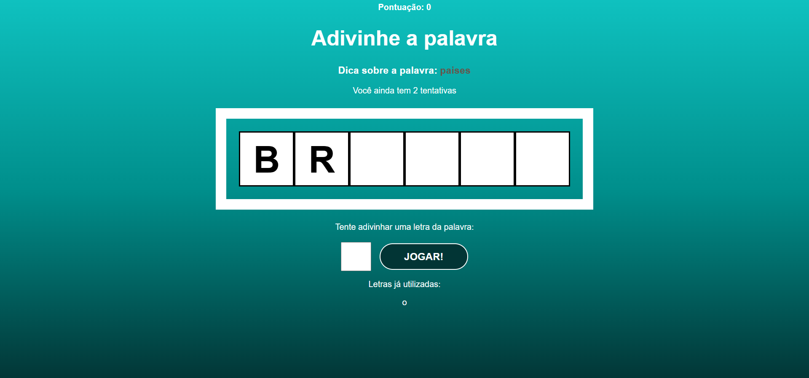
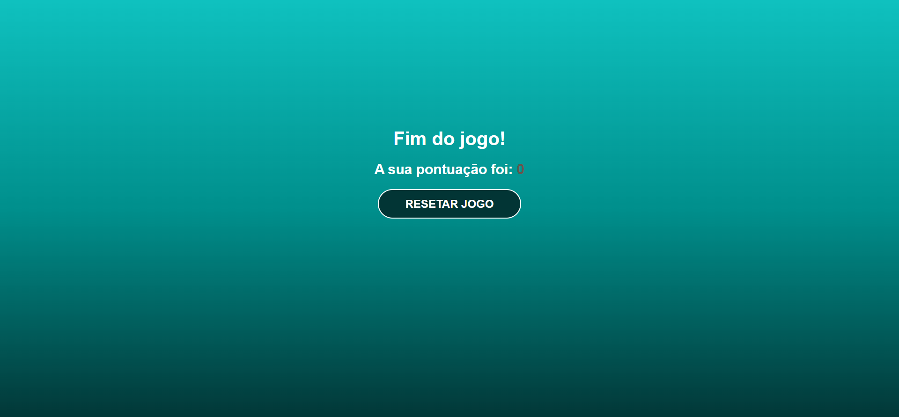

# Secret Word

> Jogo simples de adivinhação da palavra secreta, desenvolvido em React.

---

## Imagens do jogo
- Inicio

- Jogo em andamento

- Fim de jogo


---

## Sobre o projeto

Este é um jogo onde o jogador tenta adivinhar a palavra secreta letra por letra, similar a jogos de forca.
Este projeto é minha versão do curso de React "React do zero a Maestria", do Matheus Battisti, disponível na Udemy.

[React do zero a Maestria- Matheus Battisti (Udemy)](https://www.udemy.com/course/react-do-zero-a-maestria-c-hooks-router-api-projetos/)

---

## Funcionalidades

- Entrada de letras pelo teclado ou clique.
- Indicação das letras corretas e incorretas.
- Contador de tentativas restantes.
- Mensagem de vitória ou derrota.
- Reset do jogo para jogar novamente.

---

## Tecnologias usadas

- React
- JavaScript (ES6+)

---

## Como rodar o projeto localmente

1. Clone este repositório  
```bash
git clone https://github.com/AyslanMont/react-secret-word.git